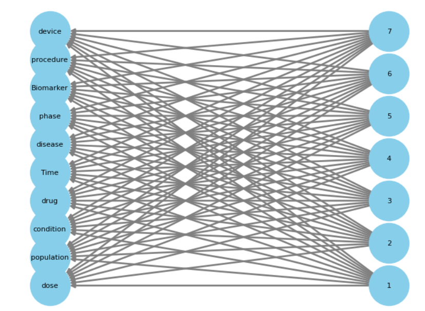

# Enhancing Entity Preservation: Using the Power of Large Language Models and Knowledge Graphs
This project aims to compare generated and original summaries, specifically preserving entity classes at the sentence level in abstractive summarization.
We utilize data from the clinicaltrials.gov brief summary and detailed description data fields. The primary objective is to generate concise summaries by transforming detailed descriptions. Initial summaries have been generated using BART, and our current focus is on comparing the generated and original summaries with regard to the preservation of entity classes.

The repository is organized into two distinct phases. In the initial phase, we input data from the clinicaltrials.gov brief summary field and generated summaries to extract ten binary features sentence-wise. These features represent entity class types, including ['disease,' 'medical condition,' 'drug,' 'device,' 'Dose or measurements,' 'clinical trial phase,' 'population,' 'Time,' 'Medical Procedure,' 'Biomarker']. The Llama 2 model facilitates the extraction of these features. To optimize processing on a GPU, we leverage vLLM, and to achieve a specific output format, we employ the LangChain framework. 

Following the extraction of binary entity classes, we create two bipartite graphs, one for the generated summary and another for the original summary. These graphs incorporate two types of nodes: entity classes and sentence numbers. Nodes are connected when the associated sentence contains the corresponding entity class. Each trial record results in two graphs, one representing the original summary and the other the BART-generated summary. The degree of similarity between these graphs indicates how effectively entity classes and their sentence structures are preserved within the summaries. We use Jaccard similarity to compare graphs.

 
